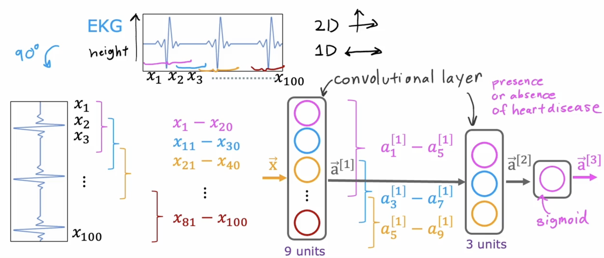

# Neural_Network_Training


## 2. Training details

### 2.1 Create the model

```python
model = Sequential([
	Dense(units=25, activation='sigmoid'),
	Dense(units=15, activation='sigmoid'),
	Dense(units=1, activation='sigmoid'),
])
```


### 2.2 Loss and cost function

 logistic loss also known as binary cross-entropy

```python
model.compile(loss=BinaryCrossentropy())
```


if you want to solve a regression problem

```python
model.compile(loss=MeanSquaredError())
```


### 2.3 Gradient descent

 compute derivatives for gradient descent using "back propagation"


repeat{

​	$w_j^{[l]} = w_j^{[l]} - \alpha \frac{\partial}{\partial w_j}J(\vec{w},b)$

​	$b_j^{[l]} = b_j^{[l]} - \alpha \frac{\partial}{\partial b}J(\vec{w},b)$

}


```python
model.fit(X, y, epoch=100)
```


# Activation Functions

## 1. Alternatives to the sigmoid activation

### 1.1 ReLU: Recified Linear Unit

$g(z) = max(o, z)$


### 1. 2Linear activation function = "No activation funciton"

$g(z) = z$


### 1.3 Sigmoid

$g(z) = \frac{1}{1 + e^{-z}}$


## 2. Choosing activation functions

### 2.1 Output layer

Binary classification: 

Sigmoid

y = 0/1


Regression:

Linear activation function

y = +/-


Regression:

price of house(never be negative)

ReLU

y = 0 or + 


### 2.2 Hiddle layer

most common choice:

ReLU


First, ReLU is a bit fast to compute


Second, more important, ReLu function goes flat only in the left, 

so the gradient descent won't be very slow. It will has faster learning


### 2.3 Choosing activation summary

output：

1. binary classification: activation = "sigmoid"
2. regression negtive/positve: activation = "linear"
3. regression $y \geq 0$ : activation = "relu"


Hiddle layer:

​	activation="relu"


so,  if the output is classification 

```python
model = Sequential([
	Dense(units=25, activation='relu'),
	Dense(units=15, activation='relu'),
	Dense(units=1, activation='sigmoid'),
])
```


## 3. Why do we need activation functions?

在一段复杂的线段中，ReLU只会符合这条线段的斜率相同的一部分，其他部分是off

如果是Linear的话，就会连斜率不相同的部分也一起覆盖了。

### 3.1 Linear example

$$
a^{[1]} = w^{[1]}_1x + b^{[1]}_1
$$


$$
a^{[2]} = w^{[2]}_1a^{[1]} + b^{[2]}_1\\
				= w^{[2]}_1(w^{[1]}_1x + b^{[1]}_1)+ b^{[2]}_1\\
				= (w^{[2]}_1 + w^{[1]}_1)x + w^{[2]}_1b^{[1]}_1 + b_1^{[2]}\\
				= wx + b
$$
so. $f(x) = wx + b$, is still a linear regression


### 3.2 example

all linear(including output)

equivalent to linear regression


output activation is sigmoid(hidden layers still linear)

equivalent to logistic regression


So, don't use linear activations in hiddle layers


# Multiclass Classification

## 1. Multiclass

multiclass classifcation problem:

target $y$ can take on more than two 

poosible values

## 2. Softmax

## 2.1 Softmax regression

#### 2.1.1 softmax regression algorithm is a generation of logistic regression 

logistic regression(2 possible output values):

$a_1 = g(z) = \frac{1}{1 + e^{-z}} = P(y = 1|\vec{x})$

$a_2 = 1 - a_1 = P(y = 0|\vec{x})$


#### 2.1.2 Softmax regression(4 possible outputs)

$z_1 = \vec{w}_1 \cdot\vec{x} + b_1$       $a_1 = \frac{e^{z_1}}{e^{z_2}+e^{z_2}+e^{z_3}+e^{z_4}} = P(y=1|\vec{x})$ 

$z_2 = \vec{w}_2 \cdot \vec{x} + b_2$

$z_3 = \vec{w}_3 \cdot \vec{x} + b_3$

  $z_4 = \vec{w}_4 \cdot \vec{x} + b_4$


#### 2.1.3 Softmax regression(N possible outputs)

  $z_j = \vec{w}_j \cdot \vec{x} + b_j$         $j = 1, 2, ..., N$

$a_j = \frac{e^{z_j}}{\sum_{k = 1}^N e^{z_k}} = P(y = j|\vec{x})$


note: $\sum^{N}_{k = 1}a_k = 1$

### 2.2 Cost 

#### 2.2.1 Logistic regression

  $z = \vec{w} \cdot \vec{x} + b$

$a_1 = g(z) = \frac{1}{1 + e^{-1}} = P(y = 1|\vec{x})$$a_2 = 1 - a_1 = P(y = 0|\vec{x})$

$a_2 = 1 - a_1 = P(y = 0|\vec{x})$


$loss = -y\log{a_1} - (1-y)\log{(1-a_1)}$


$J(\vec{w}, b) = $ average loss


#### 2.2.2 Softmax regression

$a_1 = \frac{e^{z_1}}{e^{z_1}+e^{z_2}+\dots+e^{z_N}} = P(y=1|\vec{x})$ 

...

$a_N = \frac{e^{z_N}}{e^{z_1}+e^{z_2}+\dots+e^{z_N}} = P(y=N|\vec{x})$ 


$$
loss(a_1,...,a_N,y) = \begin{cases}
    {-log(a_1)} & \text{if} \ \ y=1 \\
    \dots \\
    {-log(a_N)} & \text{if} \ \ y=N \\
\end{cases}
$$

## 3. Neural Network with Softmax output

 We can call the output layer "Softmax layer"

if we will recognize 0 to 9, it will has 10 units


specify the model:

```python
output_layer = Dense(units=10, activation='softmax')
```

specify loss and cost

```python
model.compile(loss=SparseCategoricalCrossentropy())
```

train on data on minimize $J(\vec{w}, b)$

```python
model.fit(X, Y, epochs=100)
```


## 4.  Improved implementation of softmax

### 4.1 Numerical Round off Errors

option 1

​	$x = \frac{2}{10000}$

optino 2

​	$x = (1 + \frac{1}{10000}) - (1 - \frac{1}{10000})$


### 4.2 More numerically accurate implementation of logistic loss:

Logistic regression:

​	$a = g(z) = \frac{1}{1 + e^{-z}}$

Original loss

​	$loss = -y\log{(a)} - (1 - y)\log{(1-a)}$

More accurate loss (in code)

​	$loss = -y\log{(\frac{1}{1 + e^{-z}})} - (1 - y)\log{(1-\frac{1}{1 + e^{-z}})}$


the code have more accurate loss

```python
output_layer = Dense(2, activation = 'linear')

model.compile(loss=BinaryCrossEnytopy(from_logits=True))
```


### 4.3 More numerically accurate implementation of softmax

Softmax regression

$(a_1,..., a_{10}) = g(z_1, .. , z_{10})$


$$
loss(a_1,...,a_N,y) = \begin{cases}
    {-log(a_1)} & \text{if} \ \ y=1 \\
    \dots \\
    {-log(a_10)} & \text{if} \ \ y=10 \\
\end{cases}
$$
More accurate
$$
L(\vec{a}, y) = \begin{cases}    
{-\log{\frac{e^{z_1}}{{e^{z_1}+\dots+e^{z_10}}}}} & \text{if} \ \ y=1 \\    
\dots \\    
{-\log{\frac{e^{z_{10}}}{{e^{z_1}+\dots+e^{z_10}}}}}  & \text{if} \ \ y=10 \\\end{cases}
$$
the code have more accurate loss


```python
output_layer = Den(10, activation = 'linear')

model.compile(loss=SparseCategoricalCrossEntyopy(from_logits=True))
```


### 4.4 Cross Entropy Loss Numberical Stabiliyu

$$
L(Z) = C + \log(\sum^{N}_{i = 1}e^{z_i - C}) - z_2 \ \ where \ C=max_j(z)
$$


## 5. Classification with multiple outputs

Multi-label Classification

just a picture with more than one things need to recognize


you can build networks for each outputs

or

we want train one neural network with three outputs

# Additional Neural Network Concepts

## 1. Advanced Optimization

### 1.1 gradient descent

$w_j = w_j - \alpha \frac{\partial}{\partial w_j}J(\vec{w},b) \\$

Go faster - increase $\alpha$

Go slower - decrease $\alpha$

### 1.2 Adam Algorithm Intuition 

work faster than gradient descent


Adam: Adaptive Moment Estimation

not just one $\alpha$ 

$w_1 = w_1 - \alpha_1 \frac{\partial}{\partial w_1}J(\vec{w},b) \\$

$\dots$

$w_{10} = w_{10} - \alpha_{10} \frac{\partial}{\partial w_{10}}J(\vec{w},b) \\$

$b = b - \alpha_{11} \frac{\partial}{\partial b}J(\vec{w},b) \\$


If $w_j$ (or $b$) keeps moving in same direction,

increase $\alpha_j$

If $w_j$ (or $b$) keeps oscillatiing,

decrease $\alpha_j$

 

## 2. Alternative layer types

### 2.1 Convolutional Layer

Why?

* Faster Computation
* Need less training data(less prone to overfitting)

### 2.2 Convolutional Neural Network




# Backprop Intuition(optional)

