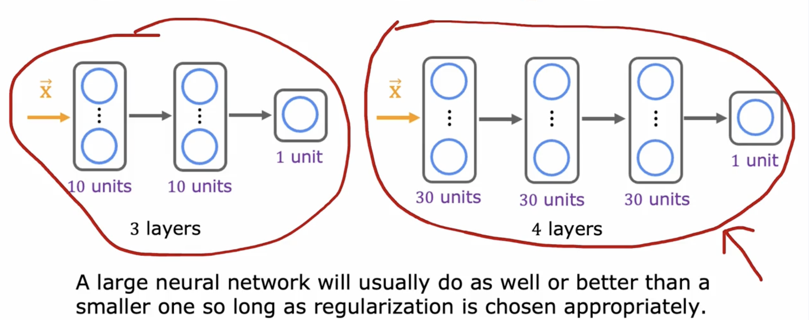

# Advice for applying machine learning 

## 1. Deciding what to try next

If it makes unacceptably large errors in predictions.
What do you try next?

* Get more training examples
* Try smaller sets of features
* Try getting additional features
* Try adding polynomial features $(x_1^2, x_2^2,x_1x_2,etc)$
* Try decreasing $\lambda$
* Try increasing $\lambda$

Diagnostic:

A test that you run to gain insight into what is/isn't working with a learning algorithm, 

to gain guidance into improving its performance

Diagostics can take time to implement 

but doing so can be a very good use of your time

## 2. Evaluating a model

In order to tell if your model is doing well, especially for applications where you have more than one or two features, which makes it difficult to plot of x.

Data set:

let 70%  $\rightarrow$ training set, 

and 30% $\rightarrow$ test set.

$n = m_{train} + m_{test}$

### 2.1 Train/test procedure for linear  regression (with squared error cost)

Fit parameters by minimizing cost function $J(\vec{w},b)$

$$
J(w,b) = \frac{1}{2m_{train}}\sum_1^{m_{train}}(f_{\vec{w},b}(\vec{x}^{(i)})-y^{(i)})^2 + \frac{\lambda}{2m_{train}}\sum^n_{j = 1}w_j^2
$$
Compute test error:
$$
J_{test}(w,b) = \frac{1}{2m_{test}}\sum_1^{m_{test}}(f_{\vec{w},b}(\vec{x}^{(i)}_{test})-y^{(i)}_{test})^2
$$
Compute training error:
$$
J_{train}(w,b) = \frac{1}{2m_{train}}\sum_1^{m_{test}}(f_{\vec{w},b}(\vec{x}^{(i)}_{train})-y^{(i)}_{train})^2
$$

### 2.2 Train/test procedure for classification problem

Fit parameters by minimizing cost function $J(\vec{w},b)$ to find $\vec{w}, b$

E.g.,
$$
J(\vec{w}, b) = -\frac{1}{m_{train}}\sum_{i = 1}^{m_{train}}[y^{(i)}log(f_{\vec{w},b}(\vec{x}^{(i)})) + (1 - y^{(i)})log(1-f_{\vec{w},b}(\vec{x}^{(i)})] + \frac{\lambda}{2m_{train}}\sum^n_{j = 1}w_j^2
$$

Compute test error:
$$
J_{test}(\vec{w}, b) = -\frac{1}{m_{test}}\sum_{i = 1}^{m_{test}}[y^{(i)}_{test}log(f_{\vec{w},b}(\vec{x}^{(i)}_{test})) + (1 - y^{(i)}_{test})log(1-f_{\vec{w},b}(\vec{x}^{(i)}_{test})]
$$

Compute training error:
$$
J_{train}(\vec{w}, b) = -\frac{1}{m_{train}}\sum_{i = 1}^{m_{train}}[y^{(i)}_{train}log(f_{\vec{w},b}(\vec{x}^{(i)}_{train})) + (1 - y^{(i)}_{train})log(1-f_{\vec{w},b}(\vec{x}^{(i)}_{train})]
$$

$J_{train}(\vec{w}, b)$ is the fraction of the train set that has been misclassified

### 2.3 Molde selection and training/cross validation/test set

 

#### 2.3.1 Training / cross validation / test set

traing set $\rightarrow$ 60%

cross validation $\rightarrow$ 20%

test set $\rightarrow$ 20%

The name of cross-validation(development set/dev set) refers to that

an extra dataset that we're going to use to check or cross check the validity or really the accuracy of different models.

For example, you can use this to make a decision on what polynomial features to add to your dateset.

**it is used for avoid overfit, and to collect the best train model**

Compute test error:
$$
J_{test}(w,b) = \frac{1}{2m_{test}}\sum_1^{m_{test}}(f_{\vec{w},b}(\vec{x}^{(i)}_{test})-y^{(i)}_{test})^2
$$
Compute training error:
$$
J_{train}(w,b) = \frac{1}{2m_{train}}\sum_1^{m_{test}}(f_{\vec{w},b}(\vec{x}^{(i)}_{train})-y^{(i)}_{train})^2
$$
Compute cross validation error:
$$
J_{cv}(w,b) = \frac{1}{2m_{cv}}\sum_1^{m_{cv}}(f_{\vec{w},b}(\vec{x}^{(i)}_{cv})-y^{(i)}_{cv})^2
$$

#### 2.3.2 Model selection

fitting a parameters (choose a polymonial)

choose a neural network architecture 

In code:

**notice that you are using the mean and standard deviation computed from the training set by just using `transform()` in the cross validation and test sets instead of `fit_transform()`.**

# Bias and variance

## 1. Diagnosing bias and variance

### 1.1 Bias/variance

### 1.2 Understanding bias and variance

As the degress of polynomial increases,

$J_{train}$ will typically go down

If the degree is too low, the $J_{vc}$ will be underfit

and the if degree is too hith, the $J_{cv}$ will be overfit

### 1.3 Diagnosing bias and variance

## 2. Regularization and bias/variance

### 2.1 Linear regression with regularization

$\lambda$ is the regularization parameter that

controls how much you trade off keeping the parameter $w$ small versus fitting the training data well

### 2.2 Choosing the regularization parameter $\lambda$

Quickly, if in this example, you find that $J_{cv}$ of $w_5, b_5$ has the lowest value of all these different cross-validation errors,

you might then decide to pick this value for $\lambda$ and so use $w_5, b_5$ as to chosen parameters.

### 2.3 Bias and variance as a function of regularization parameter $\lambda$

## 3. Establishing a baseline level of perforamnce 

what is the level of error you can reasonably hope to get to?

* Human level performance 
* Competing algorithms performance
* Guess based on experience

### 3.1 Bias/variance examples

## 4. Learning curve

### 4.1 Learning curve

### 4.2 High bias

### 4.3 High variance 

## 5. Deciding what to try next revsited

### 5.1 Debugging a learning algorithm 

If it makes unacceptably large errors in predictions.
What do you try next?

* Get more training examples (fixes high variance)
* Try smaller sets of features, like have $x^2, x^3, x^4$ (fixes high variance)
* Try getting additional features (fixes high bias)
* Try adding polynomial features $(x_1^2, x_2^2,x_1x_2,etc)$ (fixed high bias)
* Try decreasing $\lambda$ (fixes high bias)
* Try increasing $\lambda$ (fixes high variance)

## 6. Bias/variance and neural networks

### 6.1 The bias variance tradeoff

### 6.2 Neural networks and bias variance

### 6.3 Neural networks and regularization

the main way it hurts is it will slow down our training

### 6.4 Neural network regularization

in tensorflow.

