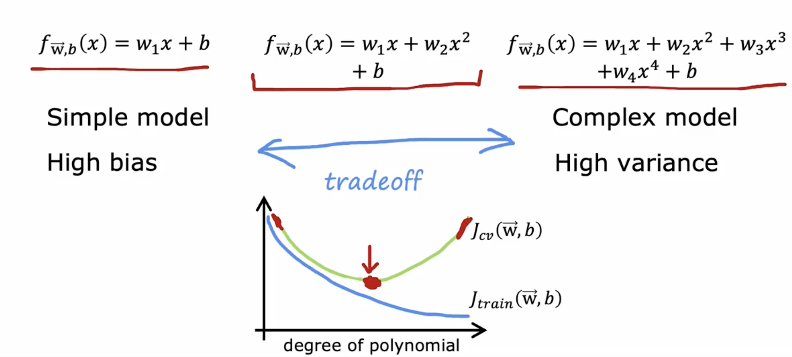

# Advice for applying machine learning 

## 1. Deciding what to try next

If it makes unacceptably large errors in predictions.
What do you try next?

* Get more training examples
* Try smaller sets of features
* Try getting additional features
* Try adding polynomial features $(x_1^2, x_2^2,x_1x_2,etc)$
* Try decreasing $\lambda$
* Try increasing $\lambda$

Diagnostic:

A test that you run to gain insight into what is/isn't working with a learning algorithm, 

to gain guidance into improving its performance

Diagostics can take time to implement 

but doing so can be a very good use of your time

## 2. Evaluating a model

In order to tell if your model is doing well, especially for applications where you have more than one or two features, which makes it difficult to plot of x.

Data set:

let 70%  $\rightarrow$ training set, 

and 30% $\rightarrow$ test set.

$n = m_{train} + m_{test}$

### 2.1 Train/test procedure for linear  regression (with squared error cost)

Fit parameters by minimizing cost function $J(\vec{w},b)$

$$
J(w,b) = \frac{1}{2m_{train}}\sum_1^{m_{train}}(f_{\vec{w},b}(\vec{x}^{(i)})-y^{(i)})^2 + \frac{\lambda}{2m_{train}}\sum^n_{j = 1}w_j^2
$$
Compute test error:
$$
J_{test}(w,b) = \frac{1}{2m_{test}}\sum_1^{m_{test}}(f_{\vec{w},b}(\vec{x}^{(i)}_{test})-y^{(i)}_{test})^2
$$
Compute training error:
$$
J_{train}(w,b) = \frac{1}{2m_{train}}\sum_1^{m_{test}}(f_{\vec{w},b}(\vec{x}^{(i)}_{train})-y^{(i)}_{train})^2
$$

### 2.2 Train/test procedure for classification problem

Fit parameters by minimizing cost function $J(\vec{w},b)$ to find $\vec{w}, b$

E.g.,
$$
J(\vec{w}, b) = -\frac{1}{m_{train}}\sum_{i = 1}^{m_{train}}[y^{(i)}log(f_{\vec{w},b}(\vec{x}^{(i)})) + (1 - y^{(i)})log(1-f_{\vec{w},b}(\vec{x}^{(i)})] + \frac{\lambda}{2m_{train}}\sum^n_{j = 1}w_j^2
$$

Compute test error:
$$
J_{test}(\vec{w}, b) = -\frac{1}{m_{test}}\sum_{i = 1}^{m_{test}}[y^{(i)}_{test}log(f_{\vec{w},b}(\vec{x}^{(i)}_{test})) + (1 - y^{(i)}_{test})log(1-f_{\vec{w},b}(\vec{x}^{(i)}_{test})]
$$

Compute training error:
$$
J_{train}(\vec{w}, b) = -\frac{1}{m_{train}}\sum_{i = 1}^{m_{train}}[y^{(i)}_{train}log(f_{\vec{w},b}(\vec{x}^{(i)}_{train})) + (1 - y^{(i)}_{train})log(1-f_{\vec{w},b}(\vec{x}^{(i)}_{train})]
$$

$J_{train}(\vec{w}, b)$ is the fraction of the train set that has been misclassified

### 2.3 Molde selection and training/cross validation/test set

 

#### 2.3.1 Training / cross validation / test set

traing set $\rightarrow$ 60%

cross validation $\rightarrow$ 20%

test set $\rightarrow$ 20%

The name of cross-validation(development set/dev set) refers to that

an extra dataset that we're going to use to check or cross check the validity or really the accuracy of different models.

For example, you can use this to make a decision on what polynomial features to add to your dateset.

**it is used for avoid overfit, and to collect the best train model**

Compute test error:
$$
J_{test}(w,b) = \frac{1}{2m_{test}}\sum_1^{m_{test}}(f_{\vec{w},b}(\vec{x}^{(i)}_{test})-y^{(i)}_{test})^2
$$
Compute training error:
$$
J_{train}(w,b) = \frac{1}{2m_{train}}\sum_1^{m_{test}}(f_{\vec{w},b}(\vec{x}^{(i)}_{train})-y^{(i)}_{train})^2
$$
Compute cross validation error:
$$
J_{cv}(w,b) = \frac{1}{2m_{cv}}\sum_1^{m_{cv}}(f_{\vec{w},b}(\vec{x}^{(i)}_{cv})-y^{(i)}_{cv})^2
$$

#### 2.3.2 Model selection

fitting a parameters (choose a polymonial)

choose a neural network architecture 

In code:

**notice that you are using the mean and standard deviation computed from the training set by just using `transform()` in the cross validation and test sets instead of `fit_transform()`.**

# Bias and variance

## 1. Diagnosing bias and variance

### 1.1 Bias/variance

### 1.2 Understanding bias and variance

As the degress of polynomial increases,

$J_{train}$ will typically go down

If the degree is too low, the $J_{vc}$ will be underfit

and the if degree is too hith, the $J_{cv}$ will be overfit

### 1.3 Diagnosing bias and variance

## 2. Regularization and bias/variance

### 2.1 Linear regression with regularization

$\lambda$ is the regularization parameter that

controls how much you trade off keeping the parameter $w$ small versus fitting the training data well

### 2.2 Choosing the regularization parameter $\lambda$

Quickly, if in this example, you find that $J_{cv}$ of $w_5, b_5$ has the lowest value of all these different cross-validation errors,

you might then decide to pick this value for $\lambda$ and so use $w_5, b_5$ as to chosen parameters.

### 2.3 Bias and variance as a function of regularization parameter $\lambda$

## 3. Establishing a baseline level of perforamnce 

what is the level of error you can reasonably hope to get to?

* Human level performance 
* Competing algorithms performance
* Guess based on experience

### 3.1 Bias/variance examples

## 4. Learning curve

### 4.1 Learning curve

### 4.2 High bias

### 4.3 High variance 

## 5. Deciding what to try next revsited

### 5.1 Debugging a learning algorithm 

If it makes unacceptably large errors in predictions.
What do you try next?

* Get more training examples (fixes high variance)
* Try smaller sets of features, like have $x^2, x^3, x^4$ (fixes high variance)
* Try getting additional features (fixes high bias)
* Try adding polynomial features $(x_1^2, x_2^2,x_1x_2,etc)$ (fixed high bias)
* Try decreasing $\lambda$ (fixes high bias)
* Try increasing $\lambda$ (fixes high variance)

## 6. Bias/variance and neural networks

### 6.1 The bias variance tradeoff

### 6.2 Neural networks and bias variance

### 6.3 Neural networks and regularization

the main way it hurts is it will slow down our training

### 6.4 Neural network regularization

in tensorflow.

# Machine learning development process

## 1. Iterative loop of ML development

### 1.1 Iterative loop of ML development

choose architecture (model, data, etc.)

train a model

Diagnostics (bias, variance and error analysis)

### 1.2 Spam classification example

Supervised learning: $\vec{x}$ = features of email

​				     $y$ = spam (1) or not spam (0)

Features: list the top 10,000 words to compute $x_1, x_2, \dots,x_{10000}$

 

### 1.3 Building a spam classifier

How to try to reduce spam classifier's error?

* Collect more data. E.g., "Honeypot" project
* Develop sophisticated features based on email routing (from email header)
* Define sophisticated features from email body. E.g., should "discouting" and "discount" be treated as the same word.
* Design algorithms to detect misspellins. E.g., w4tches, med1cine, m0rtgage.

## 2. Error analysis

### 2.1 Error analysis

$m_{cv} = 500$ examples in cross validation set.

Algoritm misclassifies 100 of them.

Manually examine 100 examples and categorize them based on common traits.

* Pharmaceutical sales
* Deliberate misspellings (w4tches, med1cine):
* Unusual email routing:
* Steal passwords (phishing):
* Spam message in embedded image:

## 3. Adding data

### 3.1 Adding data

Add more data of everything. E.g., "Honeypot" project

Add more data of the types where error analysis has indicated it might help.

​	E.g., Go to unlabeled data and find more examples of Pharama related spam.

Beyond getting brand new training examples (x,y), another technique: Data augmentation 

### 3.2 Data augmentation

Augmentation: modifying an existing training example to create a new training example

### 3.3 Data augmentation by introducing distortions

### 3.4 Data synthesis

Systhesis: using artificial data inputs to create a new training example

 

photo OCR: photo optional character recognition 

### 3.5 Engineering the data used by your system

1. Conventional model-centic approach:

2. Data-centric approach 

AI = Code (algorithm/model) + Data

## 4. Transfer learning: using data from a different task

 ### 4.1 Transfer learning 

### 4.2 Why does transfer learning work?

 

### 4.3 Transfer learning summary

1. Download neural network parameters pretrained on a large dataset with same input type (e.g., image, audio, text) as your application (or train your own)
2. Further train (fine tune) the network on your own data (a smaller training data set)

## 5. Full cycle of a machine learning project

### 5.1 Full cycle of a machine learning project

 

### 5.2 Deployment

  

## 6. Fairness, bias, and ehtics

### 6.1 Bias

Hiring tool that discriminates against women.

Facial recognition system matching dark skinned individuals to criminal mugshots

Biased bank loan approvals

Toxic effect of reinforcing negative stereotypes

### 6.2 Adverse use cases

Deepfakes

spreading toxic/incendiary speech through optimizing for engagemetn

Generating fake content for commericial or political purposes

Using ML to build harmful products, commit fraud etc

​	Spam vs anti-spam : fraud vs anti-fraud

### 6.3 Guidelines

Get a diverse team to brainstorm things that might go wrong, with emphasis on possible harm to vulnerable groups.

Carry out literature search on strandards/guidelines for your industry

Audit systems against possible harm prior to deployment

Develop mitigation plan (if applicable), and after deployment, monitor for possible harm.

# Skewed datasets (optional)

## 1. Error metrics for skewed datasets

### 1.1 Rare diseases classification example

train classifier $f_{\vec{w}, b}(\vec{x})$

($y = 1$ if disease present, and $y = 0$ otherwise)

Find that you've got 1% error on test set (99% correct diagnoses)

only 0.5% of patients have the disease

printf("y=0"), this will actually have 99.5% accuracy, 0.5% error

## 1.2 Precision/recall

  

Precision: if we say a patient has a disease, such as 0.75 to have a disease

Recall: Making sure that of all the patients taht have the disease, it's helping to diagnose a reasonable fraction of them

（precision 是测出来的人真有病的概率， recall是真有病的人会被测出来的概率）

# 2. trading off precision and recall

## 2.1 trading off precision and recall 

precision = $\frac{ture \ positive}{total \ predicted \ positive}$

recall =  $\frac{ture \ positive}{total \ actual \ positive}$

Logistic regression: $0 < f_{\vec{w}, b}(\vec{x}) < 1$

Predict 1 if $f_{\vec{w}, b}(\vec{x})$ $\geq$ 0.5

Predict 0 if $f_{\vec{w}, b}(\vec{x})$ < 0.5

suppose we want to predict $y = 1$ (rare disease) only if very confident

so that we may predict 1 if $f_{\vec{w}, b}(\vec{x})$ $\geq$ 0.7

higher precision, lower recall

suppose we want to avoid missing too many case of rare disease (when in doubt predict y = 1)

so that we may predict 1 if $f_{\vec{w}, b}(\vec{x})$ $\geq$ 0.3

higher recall, lower precision

### 2.1 F1 score

How to compare precision/recall numbers?

 Average = $\frac{P+R}{2}$ is not a good way

Instead, we use F1 score

F1 score is more close to the lower value of the precision/recall  

