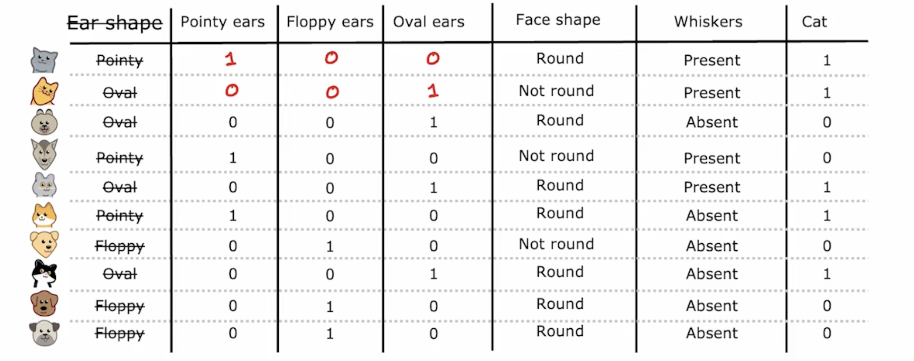
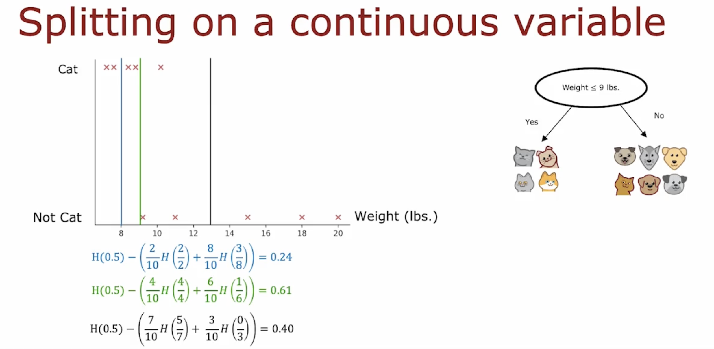

# Decision Trees

## 1. Decision Tree Model

### 1.1 Cat classification example


### 1.2 Decision Tree


## 2. Learning Process

### 2.1 Decision tree learning

 

**Decision 1:** How to choose what feature to split on at each node?

Maxmize purity (or minimize impurity)

 

**Decision 2:** When do you stop splitting?

* when a node is 100% one class
* when a splitting a node will result in the tree exceeding a maximum depth
* when improvements in purity score are below a threshold 
* when number of examples in a node is below a threshold

to avoid overfitting


# Decision Tree learning 

 ## 1. Measuring purity

### 1.1 Entropy as a measure of impurity


$p_1$ = fraction of examples that are cats

$p_0 = 1 - p_1$
$$
H(p_1) = -p_1\log_2(p_1)-p_0\log_2(p_0)\\
= -p_1\log_2(p_1)-(1-p_1)\log_2(1-p_1)
$$
Note: "$0\log(0)$ = 0"


## 2. Choosing a split: Information Gain

### 2.1 Choosing a split 


Information gain: the reduction of entropy


### 2.2 Information gain


## 3. Putting it together 

### 3.1 Decision Tree Learning

* start with all examples at the root node
* Calculate information gain for all possible features, and pick the one with the highest information gain
* Split dataset according to selected feature, and create left and right branch of the tree
* Keep repeating splitting process untill stopping criteria is met:
  * when a node is 100% one class
  * when a splitting a node will result in the tree exceeding a maximum depth
  * when improvements in purity score are below a threshold 
  * when number of examples in a node is below a threshold

### 3.2 Recursive splitting

recursive algorithm (pre root order)

can use cross validation to pick the best maximum depth


## 4. Using one-hot encoding of categorical features

### 4.1 One hot encoding



If a categorical feature can take on $k$ values, create $k$ binary features (0 or 1 valued)


### 4.2 One hot encoding and neural networks


because neural networks excepts numbers as input


## 5. Continuous valued features

features that can be any number

### 5.1 Continuous features


such as the weight there, it is well known that cat is more lightly than dog


### 5.2 Splitting on a continuous variable



pick a point to get the highest posiible information gain


## 6. Regression Trees

## 6.1 Regreesion with Decision Trees: Predicting a number

such as the weight here


### 6.2 Regression with decision tree

we can get the average number here


### 6.3 Choosing a split

we try to reduce the variance


# Tree ensembles

## 1. Using multiple decision trees

### 1.1 Trees are highly sensitive to small changes of the data


### 1.2 Tree ensemble


the final prediction is the majority vote of the prediction among these three tree.

## 2. Sampling with replacement


you maybe get the repeat sample, but that's OK.


## 3. Random forest algorithm

### 3.1 Generating a tree sample

Given training set of size $m$

For $b = 1$ to $B$:

​	Using sampling with replacement to create a new training set of size $m$

​	Train a decision tree on the new dataset


you will end up with some differnet trees. 

It's a Bagged decision tree

Set the B to be larger, never hurt the performance. But 100 is enough

### 3.2 Randomizing the feature choice

At each node, when choosing a feature to use to spilt,

If $n$ features are available, pick a random subset of $k<n$ features 

and allow the algorithm to only choose from that subset of features.


if $n$ is large, we can set $k = \sqrt{n}$


Random forest algorithms


## 4. XGBoost

### 4.1 Boosted trees intuition

Given training set of size $m$

For $b = 1$ to $B$:

​	Using sampling with replacement to create a new training set of size $m$

​		<span style="color: orange">But Instead of picking from all examples with equal (1/m) probability, make it more likely to pick misclassified examples 		from previously trained trees</span>

​	Train a decision tree on the new dataset


we're going to focus more attention on the examples that we're not yet doing well.


### 4.2 XGBoost(eXtreme Gradient Boosting)

* Open source implementation of boosted trees
* Fast efficient implementation
* Good choice of default splitting criteria and criteria for when to stop splitting
* Build in regularization to prevent overfitting
* Highly competitive algorithm for machine learing competitions (eg: Kaggle competitions)


### 4.3 Using XGBoost

Classification:

````python
from xgboost import XGBClassifier

model = XGBClassifier()

model.fit(X_train, y_train)
y_pred = model.predict(X_test)
````


Regression:

```python
from xgboost import XGBRegressor

model = XGBRegressor()

model.fit(X_train, y_train)
y_pred = model.predict(X_test)
```


## 5. When to use decision tress

 
