# Welcome!

## 1. Beyong Supervised Learning

* Unsupervised Learning
  * Clustering
  * Anomaly detection
* Recommender Systems
* Reinforcement Learning

# Clustering

## 1. What is clustering?

### 1.1 Supervised Learning

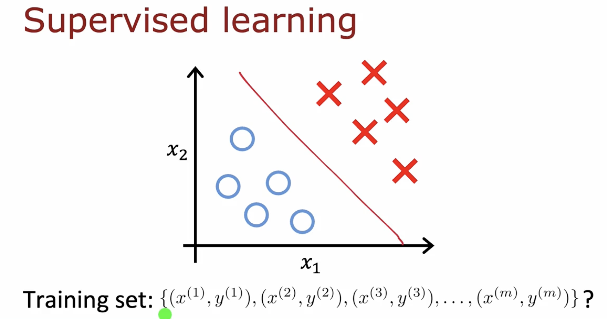

### 1.2 Unsupervised Learning

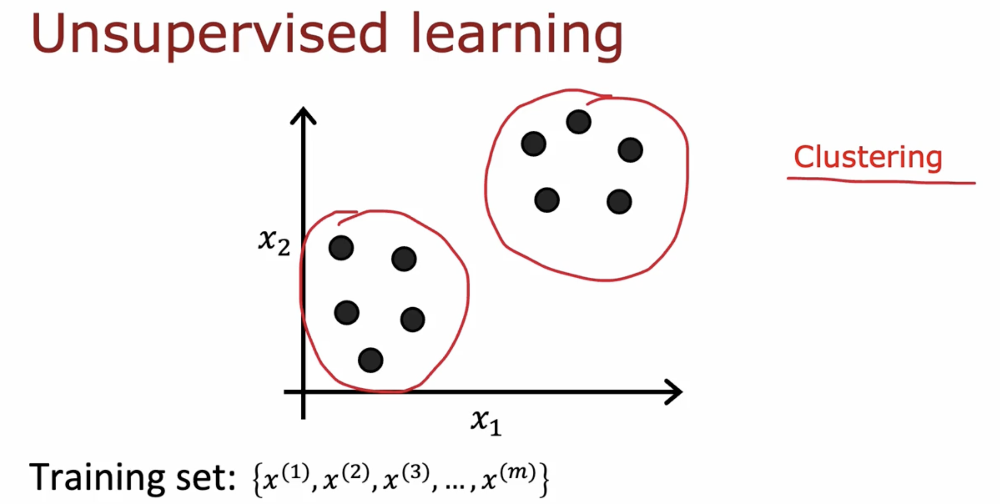

### 1.3 Application of clustering

Grouping similar news

Market segmentation

DNA analysis

## 2. K-means Intuition

repeatedly do two different things

* assign points to cluster centroids
* move cluster centroids

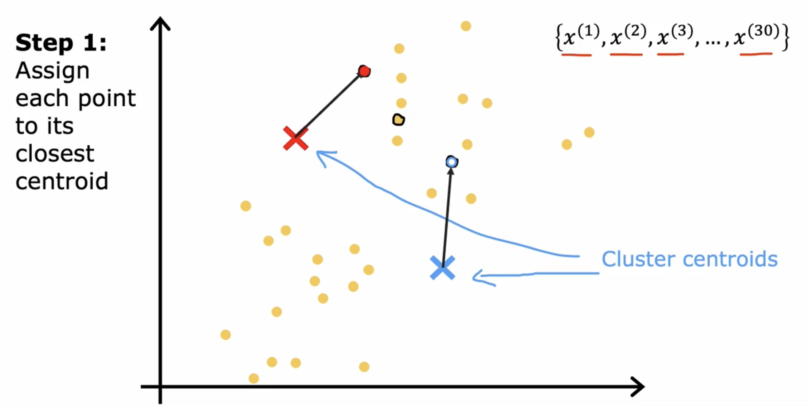

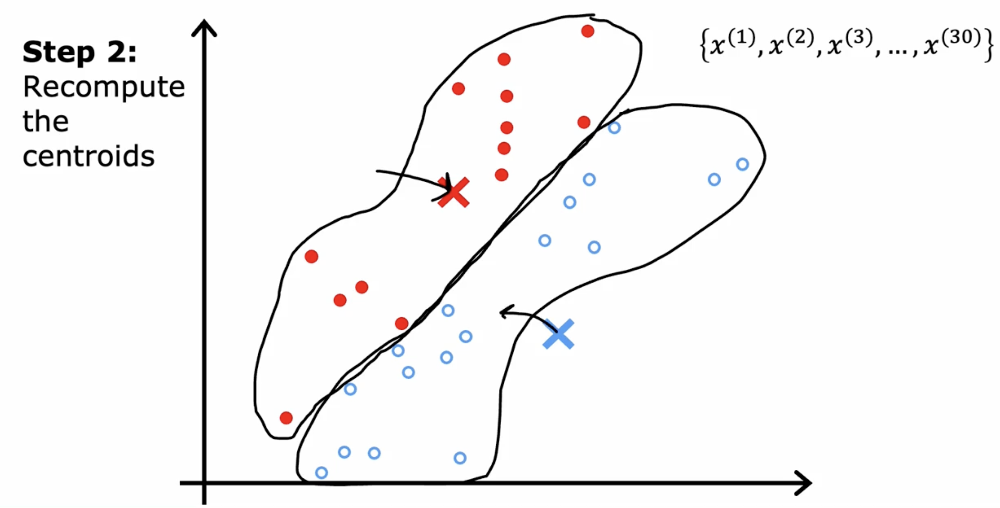

## 3. K-means algorithm 

Randomly initialize $K$ cluster centroids $\mu_1, \mu_2, ...,\mu_K$

Repreat{

​	// Assgin points to cluster centroids

 	for i = 1 to m
 		$c^{(i)}$:= index (from 1 to K) of cluster centroid closest to $x^{(i)}$  

​		($min_k ||x^{(i)}-\mu_k||$)

​	// Move cluster centroids

​	for k = 1 to K

​		$\mu_K$:=average (mean) of points assigned to cluster $k$

}	

if  a cluster has zero training examples assigned to it. 

It will run k = k - 1 to eliminate a cluster

or you really need k clusers, it can randomly reinitialize a centroid

## 4. Optimization objective

### 4.1 K-means optimization objective

$c^{(i)}$ =  index of cluster (from 1 to K)  to which example  $x^{(i)}$  is currently assigned

$\mu_K$ = cluster centroid $k$

$\mu_{c^{(i)}}$ =  cluster centroid of cluster to witch example  $x^{(i)}$  has benn assigned

Cost function: (also called distortion fucntion)
$$
J(c^{(1)},...,c^{(m)},\mu_1,...,\mu_K) = \frac{1}{m}\sum^m_{i=1}||x^{(i)}-\mu_{(c^{(i)})}||^2
$$

### 4.2 cost function for K-means

$$
J(c^{(1)},...,c^{(m)},\mu_1,...,\mu_K) = \frac{1}{m}\sum^m_{i=1}||x^{(i)}-\mu_{(c^{(i)})}||^2
$$
Repreat{

​	// Assgin points to cluster centroids

 	for i = 1 to m
 		$c^{(i)}$:= index (from 1 to K) of cluster centroid closest to $x^{(i)}$  

​		($min_k ||x^{(i)}-\mu_k||$)

​	// Move cluster centroids

​	for k = 1 to K

​		$\mu_K$:=average (mean) of points assigned to cluster $k$

}	

## 5. Initializaing K-means

### 5.1 K-means algorithm

stop0: Randomly initialize K cluster centroid $\mu_1,...,\mu_k$

repeat{

​	step1: Assign points to cluster centroids

​	step2: Move cluster centroids

}

### 5.2 Random initialization

choose K < m

Randomly pick K training examples.

set  $\mu_1,...,\mu_k$ equal to these K examples.

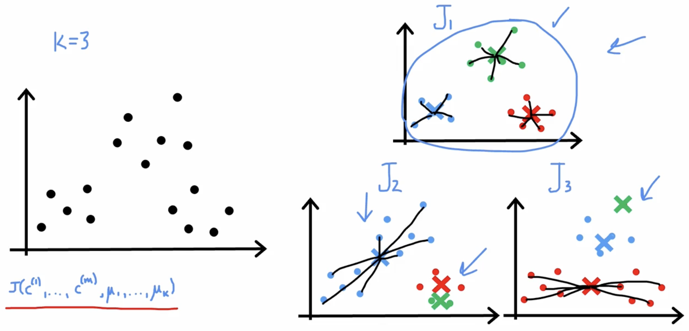

run it multiple times and choose the smallest cost function J

For i = 1 to 100 {

​	Randomly initialize K-means (k random examples)

​	Run K-means. Get $c^{(1)},...,c^{(m)},\mu_1,...,\mu_K$

​	Compute cost function (distortion) $J(c^{(1)},...,c^{(m)},\mu_1,...,\mu_K)$

}

Pick set of clusters that gave lowest cost $J$

## 6. Choosing the Number of Clusters

### 6.1 What is the right value of K?

 It is ambugious

### 6.2 Choosing the value of k

Elbow method

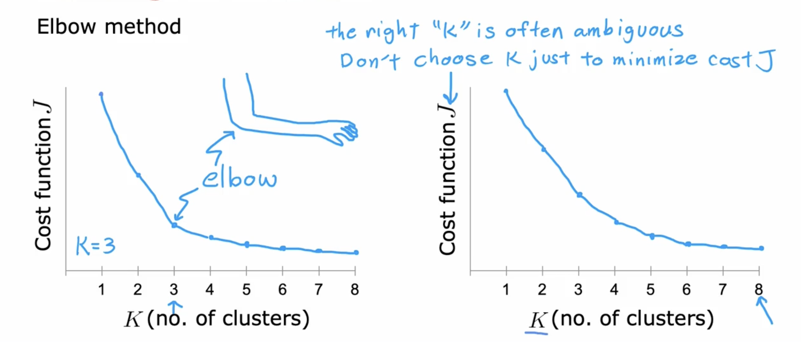

often, you want ot get clusters for some later (downstream) purpose.

Evaluate K-means based on how well it performs on that later purpose.

# Anomaly Detection

## 1. Finding unusual events

### 1.1 Anomaly detection example

Aircraft engine features:

 $x_1$ = heat generated

 $x_2$ = vibration intensity

....

Dataset: {$x^{(1)}, x^{(2)},..x^{(m)}$}

New engine: $x_{test}$

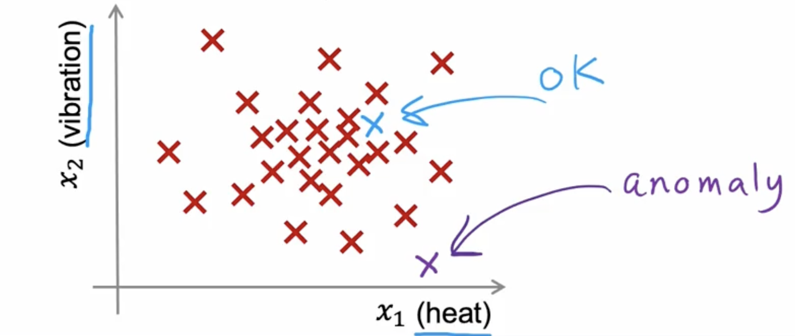

### 1.2 Density estimation

 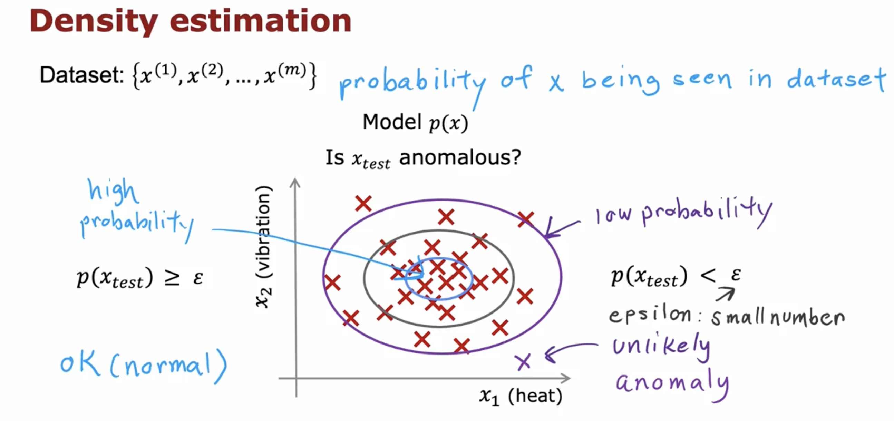

### 

## 2. Gaussian (Normal) Distribution

### 2.1 Gaussian distribution

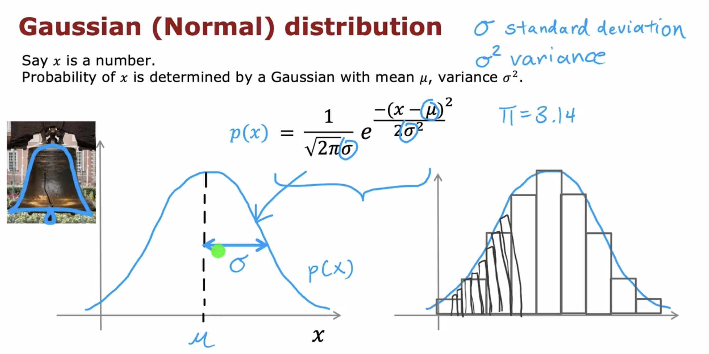

### 2.2 Gaussian distribution example

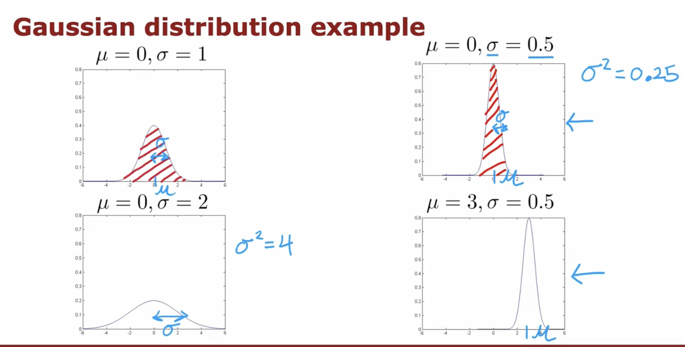

### 2.3 Parameter estimation

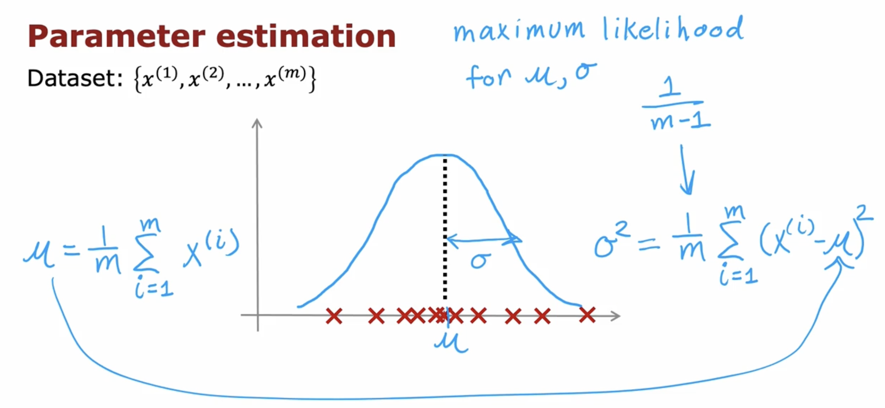

## 3. Algorithm

### 3.1 Density estimation

Training set:  {$\vec{x}^{(1)}, \vec{x}^{(2)},..\vec{x}^{(m)}$}

Each example $\vec{x}^{(i)}$ has $n$ features

$\mathbf{\vec{x}} = \begin{bmatrix} x_1 \\ x_2 \\ x_3\\ x_4   \end{bmatrix}$

it work well even without statistically  independent 
$$
p(\vec{x}) = p(x_1;\mu_1,\sigma_1^2)*p(x_2;\mu_2,\sigma_2^2)*p(x_3;\mu_3,\sigma_3^2)*\cdots*p(x_m;\mu_m,\sigma_m^2)\\
=\prod_{j=1}^n p(x_j;\mu_j,\sigma_j^2)
$$

### 3.2 Anomaly detection algorithm

1. Choose $n$ features $x_i$ that you think might be indicative of anomalous examples.
2. Fit parameters $\mu_1,...,\mu_n,\sigma_1^2,...\sigma_n^2$

​	$\mu_j = \frac{1}{m} \sum_{i = 1}^m x_j^{(i)}$ 	$\sigma_j^2=\frac{1}{m}\sum_{i=1}^m(x_j^{(i)}-\mu_j)^2$

3. Given new example $x$, compute $p(x)$:
   $$
   p(\vec{x}) = \prod_{j=1}^n p(x_j;\mu_j,\sigma_j^2) \\
   = \prod_{j=1}^n \frac{1}{\sqrt{2\pi}\sigma_j}exp(-\frac{(x_j-\mu_j)^2}{2\sigma_j^2})
   $$
   Anomaly if $p(x) < \epsilon$

### 3.2  Anomaly detection example

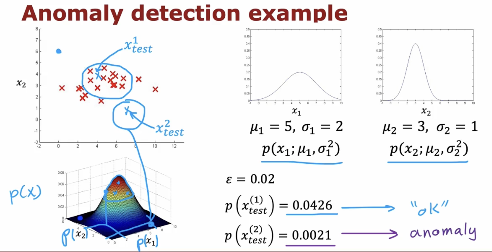

## 4. Developing and evaluating an anomaly detection system

### 4.1 The importance of real-number  evaluation

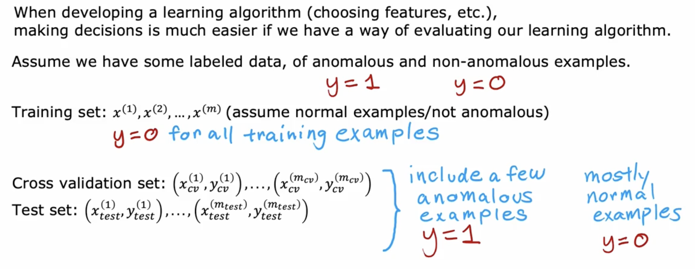

### 4.2 Aircraft engines monitoring example

10000	good (normal) engines

20	       flawed engines (anomalous)

Training set:	6000 good engines

CV:	 2000 good engines (y = 0)m	10 anmalous (y = 1)

​	use cross validation set to tune $\epsilon$, tune $x_j$

Test:      2000 good engines (y = 0)m	10 anmalous (y = 1)

If we have a few anomalous data

Alternatve: No test set
Training set:	6000 good engines

CV:	 4000 good engines (y = 0)m	20 anmalous (y = 1)

It has a higher risk of overfitting

### 4.3 Algorithm evaluation

Fit model $p(x)$ on training set $x^{(1)}, x^{(2)},...,x^{(m)}$

On a cross validation/test example $x$, predict
$$
y= \begin{cases}    
1 & \text{if} \ \ p(x) < \epsilon(anomaly) \\    
0  & \text{if} \ \ p(x) \geq \epsilon(anomaly) \\\end{cases}
$$
Possible evaluation metrics:

	- True positive, false positive, false negative, true negative
	- Precision.Recaill
	- F1-score

Use cross validation set to choose parameter $\epsilon$

## 5. Anomaly detection vs. supervised learning

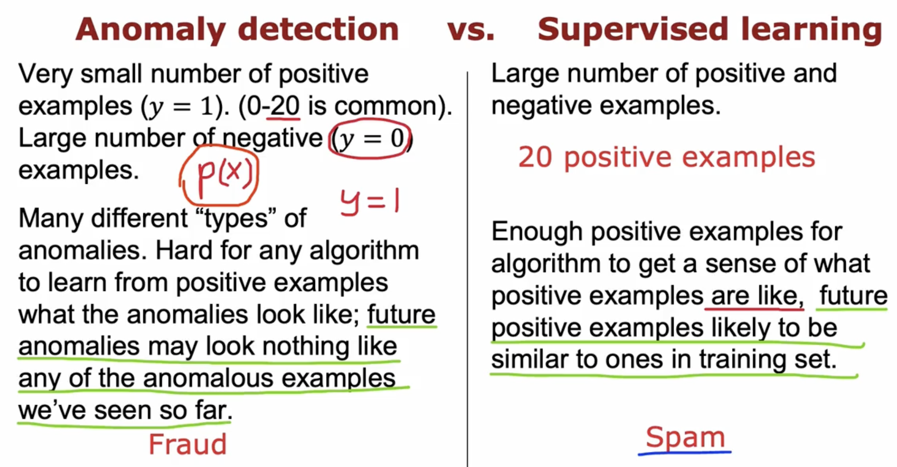

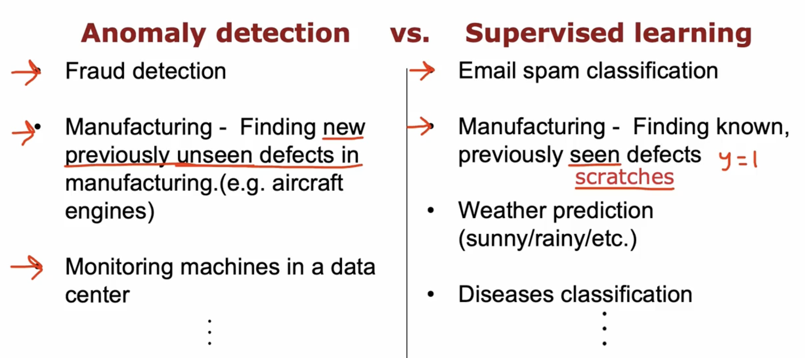

## 6. choosing what features to use

### 6.1 Non-gaussian features

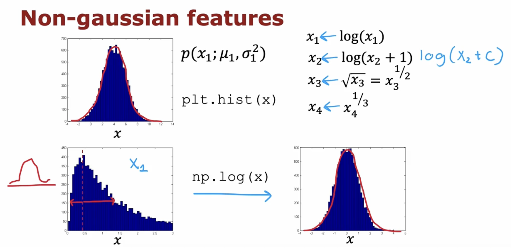

### 6.2 Error analysis for anomaly detection

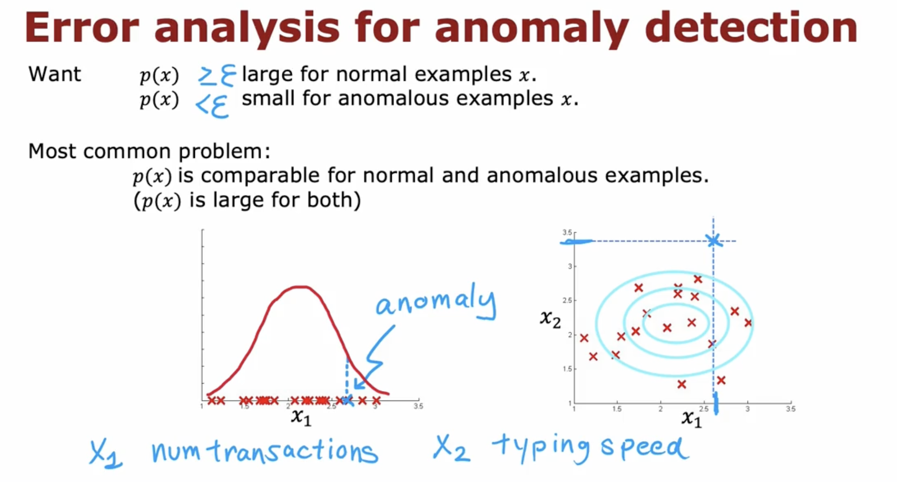

### 6.3 Monitoring computers in a data center

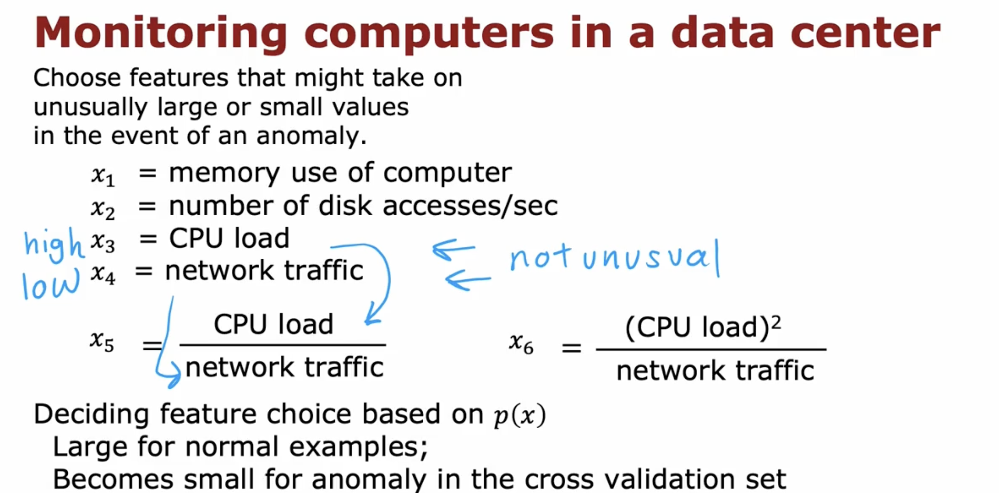
